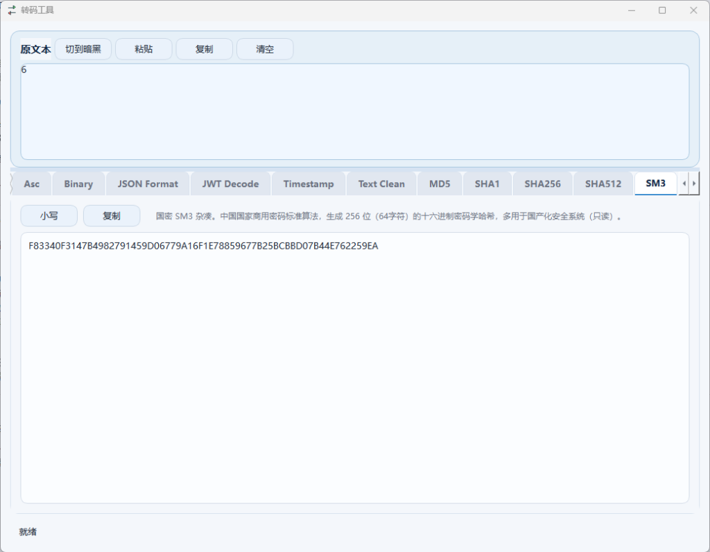

# Encode Studio (转码工具)

基于 C++ 17 与 Qt 6 Widgets 框架开发的高效、优雅的本地转码与摘要套件。

项目致力于提供免密钥、零延迟、纯本地的双向编解码与哈希指纹分析服务。界面采用精细优化的现代 UI 比例排版，并支持极速的暗黑与明亮主题一键切换。

---

## 软件界面



---

## 22 大免密钥转码功能分类

### 1. 常用编码类 (Encoding)
* **URL**：百分号编码。将非 ASCII 字符或特定符号转换为 `%XX` 格式，适用于网页 URL 传参和地址转义（双向）。
* **Query2JSON**：参数转 JSON。一键将 URL 键值对参数（`a=1&b=2`）转换为美化缩进的 JSON 格式，亦支持反向还原（双向）。
* **Base64**：标准 Base64。将字节流转换为 64 个可打印字符，解密还原时可智能兼容标准与 URL 安全格式（`-_`）（双向）。
* **Base58**：无混淆 Base58。常用于比特币地址与 IPFS 寻址，自动过滤了容易看错的 `0/O/I/l/+/-` 等符号并处理前导零（双向）。
* **Base32**：标准 Base32。按照 RFC 4648 将字符映射为 `A-Z/2-7` 序列，常用于 TOTP 二阶段验证秘钥生成及处理 `=` 补位（双向）。
* **HTML Entity**：HTML 字符实体。将特殊敏感符号（如 `<`, `>`, `&`, `"`) 编码为字符实体引用，防止前端解析时触发 XSS 注入（双向）。
* **Unicode**：Unicode 转义。转换为 `\uXXXX` 形式的通用码点，还原时支持 `\uXXXX` 和宽字符 `\UXXXXXXXX` 的自动互转（双向）。
* **Hex**：十六进制。将文字以 UTF-8 编码转化为纯十六进制字节序列（`0x...`），常用于底层协议调试或二进制分析（双向）。
* **Asc**：ASCII 十进制。将文本的 UTF-8 字节转化为以空格分隔的十进制数字序列，方便观察底层字节码值（双向）。
* **Binary**：二进制。将字符转换为 8 位一组的二进制 01 比特流，直观呈现数据在计算机底层的存储形态（双向）。

### 2. 格式美化与应用解析类 (Format & Parse)
* **JSON Format**：JSON 美化。自动识别校验 JSON 语法，转换为易读的多行缩进格式；还原时可自动将其压缩为紧凑的单行文本（双向）。
* **JWT Decode**：JWT 解析。自动拆解 JWT 校验令牌的三段结构，解码出头部与负载 JSON，并将 `exp/iat/nbf` 等时间戳翻译为北京时间（只读）。
* **Timestamp**：时间戳转换。智能互转 Unix 纪元时间与北京时间；支持 10 位（秒）与 13 位（毫秒，带 `.zzz` 格式）的自动双向互转（双向）。
* **Text Clean**：文本去重清洗。输入多行文本，一键过滤空白行、剥离首尾多余空格，并按字母排序（支持还原回原文本）（双向）。

### 3. 哈希指纹与国密杂凑 (Hash)
* **MD5**：基于 MD5 算法生成 32 位十六进制大写特征码，常用于快速数据一致性校验或指纹提取（只读）。
* **SHA1**：生成 160 位（40字符）的十六进制特征摘要，常用于传统的防篡改签名与校验（只读）。
* **SHA256**：生成 256 位（64字符）的高安全性十六进制哈希特征码，为当前主流的加密与签名算法（只读）。
* **SHA512**：生成 512 位（128字符）的极高强度十六进制哈希码，提供极高防碰撞防篡改安全保障（只读）。
* **SM3**：中国国家商用密码标准杂凑算法，生成 256 位（64字符）的十六进制密码学哈希，多用于国产化安全系统（只读）。

### 4. 进制与趣味类 (Misc & Fun)
* **Radix Convert**：进制转换。智能检测输入数值，将其在二进制（`0b...`）、八进制（`0...`）、十进制、十六进制（`0x...`）之间跨进制转换（双向）。
* **SQL_En**：SQL 注入逃逸编码。将字符串转为 UTF-16LE 字节十六进制（`0x...`），常用于绕过数据库防护层对特殊字符的检测（双向）。
* **Morse Code**：摩斯密码。将英文、数字及常用标点符号翻译为摩尔斯电码（`.-` 格式），支持输入电码反向还原文字（双向）。

---

## 交互与界面特色

* **双向极速还原**：所有可逆转码卡片均支持单独粘贴内容，点击卡片右上角的 **“还原”** 按钮直接将其反向转码并恢复到上方的“原文本”框中。
* **原文本头部分散排布**：原文本输入区标题栏排布“切换主题”、“粘贴”、“复制”、“清空”按钮，布局科学，防止误触。
* **选项卡高度自适应拉伸**：采用高雅的 `QTabWidget` 自适应分割排版，消除了旧版界面的大面积空白，并支持自适应的页签切换及左右滑动箭头。
* **实时同步计算**：原文本框内容改变时，所有 22 个卡片在后台自动增量计算，实时响应无卡顿。
* **暗黑/明亮主题切换**：内置精心调制的两套高雅现代色彩配色方案，夜晚使用更护眼。

---

## 本地构建指南

### Qt Creator 打开
直接以 CMake 项目打开本目录下的 `CMakeLists.txt`，确保编译器与 Qt 套件环境匹配：
* `MinGW` 编译器配 `Qt mingw_64` 套件（推荐）
* `MSVC` 编译器配 `Qt msvc_64` 套件

### 命令行 CMake 构建 (以 MinGW 套件为例)
打开 PowerShell 并执行以下命令：
```powershell
# 1. 配置项目，指定您的 Qt 安装路径 (请根据实际情况修改 CMAKE_PREFIX_PATH)
cmake -S . -B build_mingw -G "MinGW Makefiles" -D CMAKE_PREFIX_PATH="C:\Qt\6.10.2\mingw_64"

# 2. 编译生成 Release 版本
cmake --build build_mingw --config Release
```

---

## 绿色便携版分发打包 (推荐)
通过以下 PowerShell 脚本可以自动抽取 exe 及其全部 Qt 动态链接依赖库，生成一个可独立在其它 Windows 电脑上双击运行 the 绿色文件夹：

```powershell
# 1. 编译
cmake -S . -B build_mingw -G "MinGW Makefiles" -D CMAKE_PREFIX_PATH="C:\Qt\6.10.2\mingw_64"
cmake --build build_mingw --config Release

# 2. 创建便携输出目录
Remove-Item -Recurse -Force .\portable -ErrorAction SilentlyContinue
New-Item -ItemType Directory -Path .\portable | Out-Null

# 3. 拷贝主程序及图标
Copy-Item .\build_mingw\EncodeStudio.exe .\portable\
Copy-Item .\assets\icon.ico .\portable\

# 4. 调用 windeployqt 自动部署依赖 DLL
C:\Qt\6.10.2\mingw_64\bin\windeployqt.exe --release --compiler-runtime .\portable\EncodeStudio.exe
```
运行完成后，`.\portable` 文件夹即为绿色便携版本，可直接压缩发送给用户。
